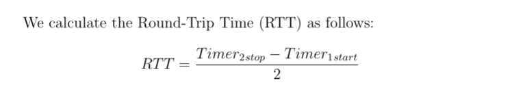

# Project Round Trip Time

### Abbreviations and Acronyms
* **Calc**: Calculate
* **Rtt**: Round Trip Time 

### Abstract
* Two timers are involved in measuring the RTT.
* Timer 1 starts when the client sends a "Ping" request.
* Timer 2 stops when the server sends a "Pong" response.

### Research Objectives
* *Calc* TCP *Rtt* in a Client Server Architecture
* *Calc* UDP *Rtt* in a Client Server Architecture
* Provide which Protocol is the fastest one

### Conclusion
TCP overhead is primarily caused by the additional control information and mechanisms it uses to ensure reliable and ordered data transmission. And this is what they call a connection.

UDP, a connectionless protocol, is faster than TCP because it doesn't establish a connection before sending the data, which reduces overhead but can lead to less reliable communication.

### Made with
* Java
* Maven